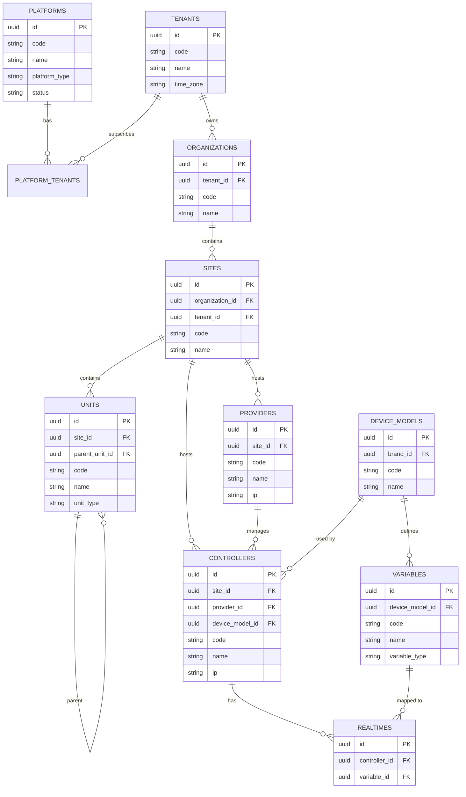

# Entity-Relationship Diyagramlari

Bu dokuman, veritabani semasinin gorsel temsillerini icerir.

---

## 1. Ana Hiyerarsi (Mermaid)



---

## 2. Tenant Ecosystem (ASCII)

```
+===========================================================================+
|                              PLATFORM LAYER                                |
+===========================================================================+
|                                                                           |
|    +---------------+         +-------------------+                        |
|    |   platforms   |<------->| platform_tenants  |                        |
|    +---------------+         +-------------------+                        |
|          |                           |                                    |
|          v                           v                                    |
|    +---------------+         +-------------------+                        |
|    | platform_     |         | platform_versions |                        |
|    | features      |         +-------------------+                        |
|    +---------------+                                                      |
|                                                                           |
+===========================================================================+
                                   |
                                   | N:N
                                   v
+===========================================================================+
|                               TENANT LAYER                                 |
+===========================================================================+
|                                                                           |
|                          +---------------+                                |
|                          |    tenants    |                                |
|                          +---------------+                                |
|                                 |                                         |
|     +--------------+------------+------------+----------------+           |
|     |              |            |            |                |           |
|     v              v            v            v                v           |
| +--------+  +----------+  +--------+  +----------+  +---------------+    |
| |billing |  |subscript.|  |credits |  | quotas   |  | organizations |    |
| | _info  |  |          |  |        |  |          |  +---------------+    |
| +--------+  +----------+  +--------+  +----------+        |              |
|    1:1         1:N           1:1         1:N              |              |
|                                                           v              |
|                                                    +-------------+       |
|                                                    |    sites    |       |
|                                                    +-------------+       |
|                                                           |              |
|                                                           v              |
|                                                    +-------------+       |
|                                                    |    units    |<--+   |
|                                                    +-------------+   |   |
|                                                           |          |   |
|                                                           +----------+   |
|                                                         (self-ref)       |
+===========================================================================+
```

---

## 3. IoT/SCADA Layer (ASCII)

```
+===========================================================================+
|                            IoT / SCADA LAYER                              |
+===========================================================================+
|                                                                           |
|                              +-------------+                              |
|                              |    sites    |                              |
|                              +-------------+                              |
|                                    |                                      |
|                    +---------------+---------------+                      |
|                    |                               |                      |
|                    v                               v                      |
|             +-------------+               +---------------+               |
|             |  providers  |               |  supervisors  |               |
|             +-------------+               +---------------+               |
|                    |                               |                      |
|                    | 1:N                           | N:N                  |
|                    v                               v                      |
|             +-------------+         +---------------------------+         |
|             | controllers |<------->| supervisor_controllers    |         |
|             +-------------+         +---------------------------+         |
|                    |                                                      |
|                    | 1:N                                                  |
|                    v                                                      |
|             +-------------+         +---------------+                     |
|             |  realtimes  |-------->|   variables   |                     |
|             +-------------+         +---------------+                     |
|                    |                       |                              |
|                    |                       v                              |
|                    |               +---------------+                      |
|                    +-------------->| device_models |                      |
|                                    +---------------+                      |
|                                           |                               |
|                                           v                               |
|                                    +---------------+                      |
|                                    | device_types  |                      |
|                                    +---------------+                      |
|                                                                           |
+===========================================================================+
```

---

## 4. Alarm Ecosystem (ASCII)

```
+===========================================================================+
|                            ALARM ECOSYSTEM                                |
+===========================================================================+
|                                                                           |
|    +---------------+         +-------------------+                        |
|    |    alarms     |-------->|    realtimes      |                        |
|    | (active)      |         +-------------------+                        |
|    +---------------+                  |                                   |
|           |                          |                                   |
|           |                          v                                   |
|           |                  +---------------+                           |
|           |                  |  controllers  |                           |
|           |                  +---------------+                           |
|           |                                                              |
|           v                                                              |
|    +-------------------+                                                 |
|    | alarm_histories   |------------------------------------------+      |
|    | (all history)     |                                          |      |
|    +-------------------+                                          |      |
|           |                                                       |      |
|           +-- controller_id                                       |      |
|           +-- variable_id                                         |      |
|           +-- provider_id                                         |      |
|           +-- site_id                                             |      |
|           +-- organization_id                                     |      |
|           +-- tenant_id  <-- Denormalized for performance         |      |
|           +-- contractor_id                                       |      |
|           +-- priority_id ----------------------------------------+      |
|                                                                   |      |
|                                                           +-------v----+ |
|    +-------------------+                                  | priorities | |
|    | alarm_operation_  |                                  +------------+ |
|    | actions           |                                                 |
|    +-------------------+                                                 |
|           |                                                              |
|           v                                                              |
|    +-------------------+                                                 |
|    | operation_actions |                                                 |
|    +-------------------+                                                 |
|                                                                          |
+===========================================================================+

ANALYTICS & ML:

+-------------------+     +-------------------+     +-------------------+
| alarm_analytics_  |---->| alarm_patterns    |     | alarm_predictions |
| sessions          |     +-------------------+     +-------------------+
+-------------------+            |                         |
        |                        v                         v
        +---------------------> alarm_anomalies <---------+
                               +-------------------+
                                        |
                                        v
                               alarm_correlations
                               +-------------------+
```

---

## 5. Subscription & Billing (ASCII)

```
+===========================================================================+
|                       SUBSCRIPTION & BILLING                              |
+===========================================================================+
|                                                                           |
|                          +---------------+                                |
|                          |    tenants    |                                |
|                          +---------------+                                |
|                                 |                                         |
|         +-----------------------+-----------------------+                 |
|         |                       |                       |                 |
|         v                       v                       v                 |
| +----------------+    +------------------+    +------------------+        |
| | tenant_billing |    | tenant_          |    | tenant_credits   |        |
| | _info          |    | subscriptions    |    |                  |        |
| +----------------+    +------------------+    +------------------+        |
|       1:1                    |                       |                    |
|                              v                       v                    |
|                    +------------------+    +------------------+           |
|                    | subscription_    |    | credit_packages  |           |
|                    | plans            |    |                  |           |
|                    +------------------+    +------------------+           |
|                              |                       |                    |
|                              v                       v                    |
|                    +------------------+    +------------------+           |
|                    | plan_quotas      |    | tenant_credit_   |           |
|                    |                  |    | transactions     |           |
|                    +------------------+    +------------------+           |
|                                                                           |
|         +------------------+    +------------------+                      |
|         | tenant_payment_  |    | tenant_invoices  |                      |
|         | methods          |    |                  |                      |
|         +------------------+    +------------------+                      |
|                |                       |                                  |
|                v                       v                                  |
|         +------------------+    +------------------+                      |
|         | tenant_payment_  |<---| (payment link)   |                      |
|         | transactions     |    |                  |                      |
|         +------------------+    +------------------+                      |
|                                                                           |
+===========================================================================+
```

---

## 6. Inventory & Asset (ASCII)

```
+===========================================================================+
|                         INVENTORY & ASSET                                 |
+===========================================================================+
|                                                                           |
|    +---------------+                                                      |
|    |    tenants    |                                                      |
|    +---------------+                                                      |
|           |                                                               |
|           v                                                               |
|    +---------------+         +-------------------+                        |
|    | inventories   |-------->| inventory_types   |                        |
|    +---------------+         +-------------------+                        |
|           |                                                               |
|           v                                                               |
|    +-------------------+                                                  |
|    | inventory_items   |                                                  |
|    +-------------------+                                                  |
|           |                                                               |
|           v                                                               |
|    +---------------+         +---------------+                            |
|    |     items     |-------->|    brands     |                            |
|    +---------------+         +---------------+                            |
|           |                         |                                     |
|           |                         v                                     |
|           |                  +---------------+                            |
|           |                  | device_models |                            |
|           |                  +---------------+                            |
|           |                                                               |
|           v                                                               |
|    +-------------------+         +-------------------+                    |
|    | inventory_item_   |-------->| item_location_   |                     |
|    | movements         |         | history          |                     |
|    +-------------------+         +-------------------+                    |
|                                         |                                 |
|                                         v                                 |
|                                  +-------------+                          |
|                                  |    units    |                          |
|                                  +-------------+                          |
|                                                                           |
|    ASSET CONNECTION TO IoT:                                               |
|                                                                           |
|    +---------------+                  +---------------+                   |
|    |     items     |----------------->| controllers   |                   |
|    | (device_item) |                  | (device_item_id)                  |
|    +---------------+                  +---------------+                   |
|                                                                           |
+===========================================================================+
```

---

## 7. Tam Hiyerarsi Akisi (Top to Bottom)

```
                         +==================+
                         |    PLATFORMS     |
                         | (PMS, EMS, CMMS) |
                         +==================+
                                  |
                                  | platform_tenants (N:N)
                                  v
                         +==================+
                         |     TENANTS      |
                         | (Customers)      |
                         +==================+
                                  |
            +---------------------+---------------------+
            |                     |                     |
            v                     v                     v
    +--------------+     +--------------+     +----------------+
    | CONTRACTORS  |     | ORGANIZATIONS|     | SUBSCRIPTIONS  |
    | (N:N)        |     | (1:N)        |     | BILLING        |
    +--------------+     +--------------+     +----------------+
                                |
                                v
                         +==================+
                         |      SITES       |
                         | (Buildings)      |
                         +==================+
                                |
            +-------------------+-------------------+
            |                   |                   |
            v                   v                   v
    +--------------+     +--------------+     +--------------+
    |    UNITS     |     |  PROVIDERS   |     | SUPERVISORS  |
    | (Areas)      |     | (Gateways)   |     | (Monitors)   |
    +--------------+     +--------------+     +--------------+
            |                   |                   |
            v                   |                   |
    +--------------+            |                   |
    | UNITS (sub)  |            |                   |
    | (recursive)  |            |                   |
    +--------------+            |                   |
                               |                   |
                               v                   v
                         +==================+
                         |   CONTROLLERS    |
                         | (PLCs, RTUs)     |
                         +==================+
                                |
                                v
                         +==================+
                         |    REALTIMES     |
                         | (Live Data)      |
                         +==================+
                                |
                                v
                         +==================+
                         |    VARIABLES     |
                         | (Measurements)   |
                         +==================+
                                |
                                v
                         +==================+
                         |  ALARMS/EVENTS   |
                         +==================+
```

---

## 8. Veri Yolu Matrisi

| From \ To | Platform | Tenant | Org | Site | Unit | Controller | Provider | Variable |
|-----------|----------|--------|-----|------|------|------------|----------|----------|
| Platform | - | N:N | - | - | - | - | - | - |
| Tenant | N:N | - | 1:N | 1:N* | 1:N* | 1:N* | 1:N* | - |
| Org | - | N:1 | - | 1:N | 1:N* | - | - | - |
| Site | - | N:1* | N:1 | - | 1:N | 1:N | 1:N | - |
| Unit | - | N:1* | N:1* | N:1 | Self | 1:N | 1:N | - |
| Controller | - | N:1* | - | N:1 | N:1 | - | N:1 | via Realtime |
| Provider | - | N:1* | - | N:1 | N:1 | 1:N | - | - |
| Variable | - | - | - | - | - | via Realtime | - | - |

*: Redundant/Opsiyonel baglanti (performans icin)

---

## Notlar

1. **Mermaid Diyagramlari:** GitHub, GitLab ve bircok markdown renderer tarafindan desteklenir.

2. **ASCII Diyagramlari:** Tum ortamlarda goruntulenebilir, versiyon kontrolu icin ideal.

3. **Diyagram Araclari Onerileri:**
   - [dbdiagram.io](https://dbdiagram.io) - DBML formati
   - [DrawSQL](https://drawsql.app) - Visual ER designer
   - [pgModeler](https://pgmodeler.io) - PostgreSQL specific
   - [DBeaver](https://dbeaver.io) - ER diagram from existing DB
